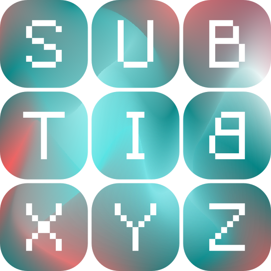

<div align="center">  </div>

# Subbit.xyz

> Cardano's Featherweight L2

## About

Subbit.xyz provides a tiny wrapper around services to make them _trustless
subscriptions_.

For more about Subbit.xyz, check out the [site](https://subbit.xyz) for an
overview.

Status: WIP.

## Roadmap/TODOs

We are very excited to have been successful with our F13 proposal.

The proposal tracker is
[here](https://milestones.projectcatalyst.io/projects/1300174). The first three
milestones concern Subbit.xyz. The subsequent two concern a real world
application with our partners at [Orcfax](https://orcfax.io). The final
milestone will be polishing, and outreach.

The output of the first three milestones will be mainly found here:

- [x] M1: Spec & validator
- [x] M2: Tx builders
- [ ] M3: Integration toolkit/ SDK and e2e example

## Repo

This repo uses flakes. If you don't use flakes, you'll probably want aiken on
path along with other dependencies.

```
$tree -L 1
.
├── aik  # Aiken, on-chain code
├── docs # Docs
├── flake.lock
├── flake.nix
└── js   # Javascript based tx builders
```

## Using Subbit.xyz

If you think Subbit.xyz is a good fit for you needs, please get in touch via a
github issue, or otherwise.

While we're still cooking is a great time to share potential applications.

Once we're ready, there will be docs and examples for self on-boarding.

For the brave: head to `./js/packages/jobs/`

## Partners & Sponsors


[Kompact.io](https://kompact.io)


[Orcfax](https://orcfax.io)


[Project Catalyst](https://projectcatalyst.io)
