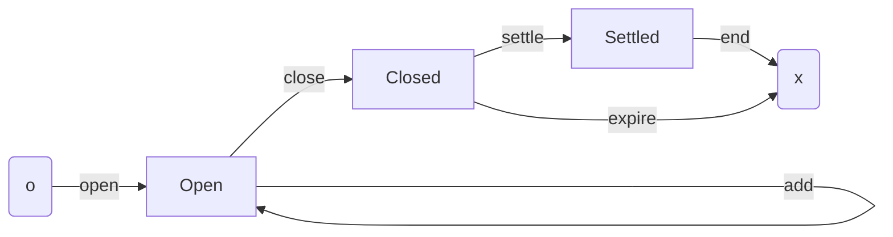

## Context

This ADR is mainly to lay some foundations on which to begin designing
Subbit.xyz. It is concerned with the mechanics of the L1 part of Subbit.xyz, ie
the subbit.

The form presented here borrows from the learning of conducting a similar
process for [Cardano Lightning](https://cardano-lightning.org). Some of the
content is adapted or verbatim from the corresponding ADR there.

Subbit.xyz provides a thin wrapper by which services can be offered as trustless
subscriptions.

A service is provided by a **provider** and consumed by a **consumer**. There
may be many of either type (ie a provider may have many consumers, and a
consumer many providers). Subbit.xyz allows the consumer to recompense the
provider without either **participant** having funds at risk.

Each pair of transacting provider and consumer have a **subbit** underwriting
their engagement. The unbranded term for subbit would be "channel".

On-chain, a **subbit** is represented by utxos, at most one at tip at any one
time. While such a utxo exists at tip, the subbit is **staged** (see 'stages'
below). After the utxo is spent and not replaced, the subbit is **unstaged**. A
subbit that is unstaged will never again be staged. Unless otherwise specified,
"subbit" generally means "subbit that is staged".

A subbit has state on the L1. Note that we avoid using the term "state" to have
a specified meaning. This is so it can be employed and specified in a given
context without being confusing. The relevant state may be the datum, or the
datum and value, or the whole utxo, or a set of utxos, or include additional
off-chain data _etc_.

The Cardano unit of change is the transaction. A transaction involving a subbit
is said to **step** the subbit. A single transaction may involve many subbits.
From the perspective of a single subbit, we can abstract transactions and talk
in terms of steps.

The term step is used both to refer to a specific event, or a general family of
events. For example: "this transaction steps that subbit", and "an 'open' is the
initial step of a subbit".

A staged subbit will be at a **stage** in its lifecycle. A step may:

- stage or unstage a subbit,
- take a subbit from a stage to the same stage, or
- take a subbit from one stage to the next stage

## Decision

### Overview

Nodes are stages; arrows are steps.

### Rationale

A consumer does an **open** step. This stages a subbit into its **opened**
stage. In an open the consumer fixes the "constants" of the subbit, and include
things like the close period. These are pre-agreed with the provider. If they
diverge from what the provider deems acceptable (eg the close period is too
short), they should not provide service to the consumer.

The opened stage is the main stage of the subbit. In the open step the consumer
locks funds at the utxo as guarantee of their off-chain transacting (on the L2).
During this stage partners are actively transacting on the L2, with the consumer
sending the provider ious in exchange for bits for service.

While the subbit is opened, the consumer may do an **add** step. This does not
change the stage of the subbit. There is no limit to how many add steps can be
performed. An add locks more funds in the subbit as further guarantee of their
off-chain transacting.

While the subbit is opened, the provider may do a **sub** step. This does not
change the stage of the subbit. There is no limit to how many add steps can be
performed. A sub removes funds in the subbit, the amount must be attested for by
the presentation of a valid iou.

Once a consumer no longer wishes to continue the engagement they do a **close**
step. The subbit is now **closed**. This marks the beginning of the close
period.

On a close of a subbit, the respond period begins. The length of this period is
a property of the script, and known by partners on an open.

The provider may now do a **settle** step. This is essentially their final sub.

The consumer can now do the **end** step, unstaging the subbit, and reclaiming
the remaining funds.

Alternatively, if the provider fails to settle before the close period expires,
then the provider is assumed to have abandoned their obligations. In such case,
the consumer can do an **expire** step. An expire step is a terminal step in
which the consumer receives all remaining funds.

## Discussion, Counter and Comments

.

### Comments

.

### Considered Alternatives

We could re-use redeemers without too much issue. For example the redeemer in
the settle step could sensibly reuse sub. Similarly we could have a single
redeemer for "close", "end", and "expire", and infer the step details from the
stage of the subbit.

It is mildly more explicit to reserve a different constructor for each of the
steps as outlined above. It is barely more expensive, or more complex. There are
are only 7 "steps"" and only 6 are "continuing" ie correspond to spend redeemers
and naturally to 6 alternate constructors. Thus the cbor tags will run from
121-126. If we had more than 7, we many be more inclined to reuse the
constructors, to avoid reaching for the "overflow" cbor tags.

## Consequences

.
