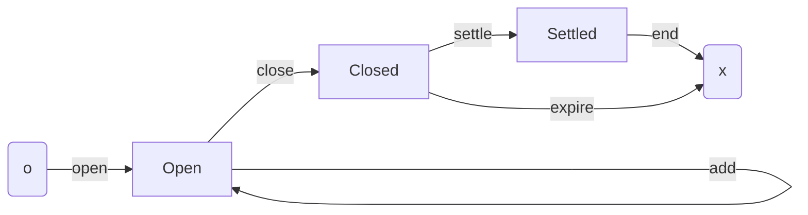
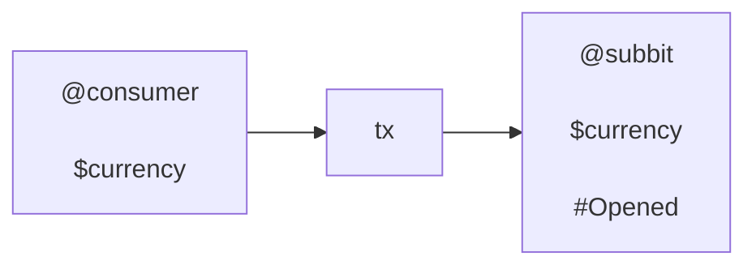
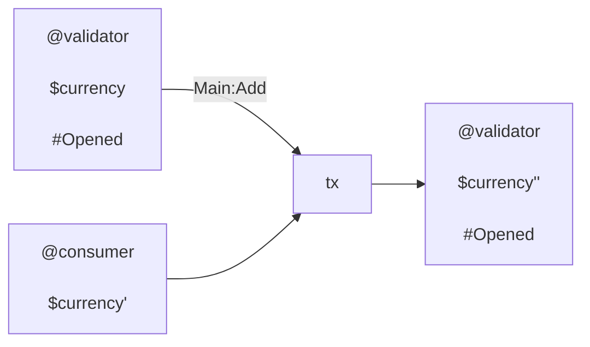
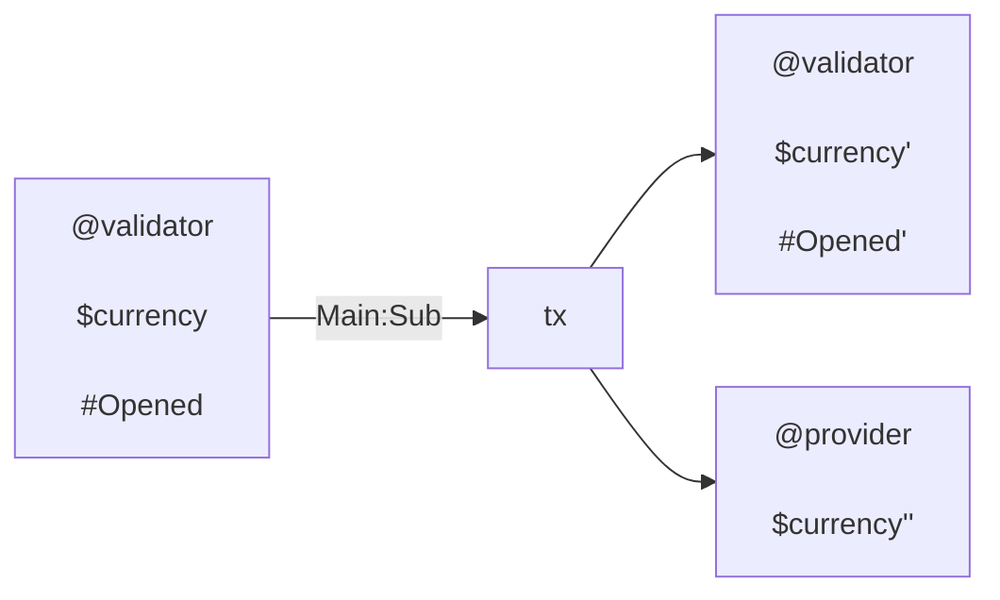
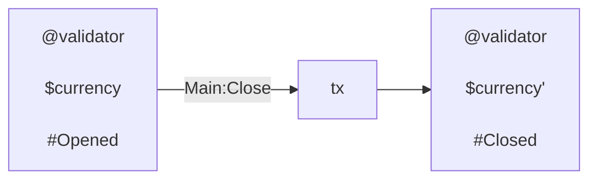
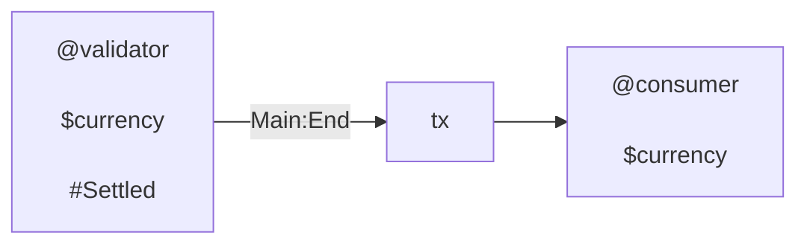
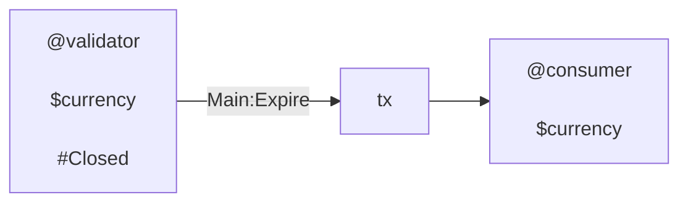
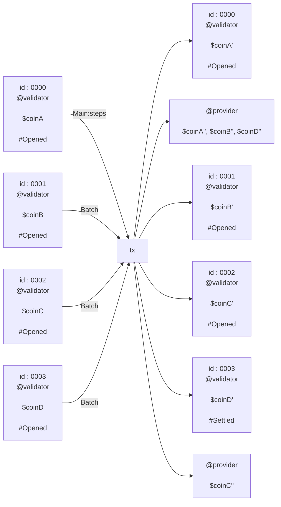
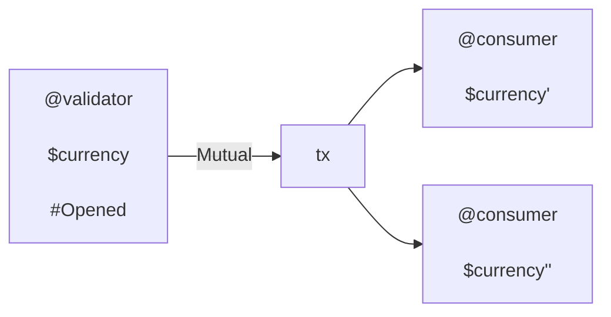

## Intro

This document contains:

- A non-technical description of how the dapp works
- A description of terms
- A specification in terms of validator logic, datatypes, and transactions (txs)
- Additional comments

### Context

A service is run by a _provider_ and paid for by _consumers_. Traditionally,
payment is either:

- user pays upfront into provider controlled account
- done by auto-debit, direct debit, with some underwriting by a bank or similar
  institution
- user pays in arrears

These require trust between parties, which implies risk, which in turn implies
additional costs. Risk exposure stifles access: either consumers denied coverage
because of poor or unknown credit scores, or new providers lacking the
reputation to be trusted by consumers.

Some, particularly digital services, use alternative monetization such as ads
and data harvesting. This is may be because the friction of payment is too great
with traditional methods, or the costs of handling the transactions is too big.

### Subbit.xyz

Subbit.xyz providers a tiny wrapper for services to be offered as _trustless
subscriptions_.

At its core, Subbit.xyz uses unidirectional two-party payment channels. It is
probably the simplest useful L2. It models the most typical type of on-going
financial engagement: a consumer paying a provider.

With Subbit.xyz, each time the consumer makes a request to the provider for a
bit more service, they include an iou (see
[iou](https://en.wikipedia.org/wiki/IOU)). An iou includes a "code" that the
provider can use to receive funds at a time of their choosing. The ious are
cumulative so the provider uses only the latest one when that time comes.

The consumer creates each iou and so is in control on how much they are
permitting the provider to claim. The provider can claim no more than the code
permits. The consumer can stop the engagement at any point. The provider
verifies each iou is correct for the context of the request. If the iou is bad,
the provider can choose to not provide service and end the engagement with
latest valid iou.

The engagement is backed by a **subbit** (aka a channel) on the L1 (Cardano).
This is created and funded by the consumer. The provider redeems funds attested
for be a valid iou. The consumer may close their subbit to recover their funds.
The funds remain held for a period in which the provider can see the consumers
intent to terminate the engagement, and make their last "sub" of funds.

This is what makes the arrangement _trustless_. At worst, the provider can make
off with a valid iou that they have not honored with the corresponding bit of
service. In application, the individual increment of an iou should be small
enough that its loss is no more than an annoyance to the consumer.

### Supporting documents

This spec draws on the following ADRs:

- [lifecycle](../adrs/lifecycle.md) - The subbit lifecycle
- [auth](../adrs/auth.md) - On handling authentication
- [batching](../adrs/batching.md) - On handling subbits in batch
- [mutual txs](../adrs/mutual-txs.md) - On handling mutually arranged txs
- [funds](../adrs/funds.md) - On funds and currency of a subbit
- [subbit id](../adrs/subbit-id.md) - On handling the subbit id
- [iou](../adrs/iou.md) - On the definition of an iou

The [glossary](../glossary.md) may also prove a helpful resource.

## Design considerations

### Subbit lifecycle

The lifecycle of a subbit is as follows:



Nodes are **stages**; arrows are **steps**.

The consumer wishes to receive the services of a provider. The consumer `open`s
a subbit account including details from the provider.

While the account is open, the consumer repeatedly requests service from the
provider. This happens off-chain. Each request, the consumer includes a
redemption code to the provider. The provider can verify that the code is
correct (the account is sufficiently funded, _etc_), and can honor the request.

The provider is protected by the L1 in that at a time of their choosing they can
`sub` their dues from the account. The consumer is protected by the L1 in that
the provider can `sub` only as much as the last redemption code.

Whenever the account is low, the consumer can `add` to their account.

Once the consumer no longer wants the service, they can `close` the subbit.
There is then a close period during which provider `settle`s with the consumer.
After this the consumer can `end` the subbit, retrieving all remaining funds.

If the provider fails to settle, they are deemed to have abandoned their
obligation. Once the close period has expired, the consumer can `expire` the
subbit, again retrieving all remaining funds.

### Batching

Batching steps of multiple subbits into single txs is first class in the design.
It makes maintaining many subbits as provider or consumer much more efficient.
We will produce numbers on how many subbits can be stepped in a typical tx.

See the ADR on [batching](../adrs/batching.md) for an exposition on:

- why `own_hash` appears in the datum,
- a justification on why this is safe
- additional constraints on txs (specifically output ordering) that aid
  implementation efficiency

#### Mutual txs

Mutual txs allow partners of a subbit to carry perform an arbitrary spend,
provide they both consent, by signing the tx. See the ADR on
[mutual txs](../adrs/mutual-txs.md) for an account of this decision.

Mutual txs must include no other inputs from validator address.

## Datatypes

The following are the definitions of the datatypes Subbit.xyz uses. They are
expressed in the aiken language.

```aiken
type Constants {
  subbit_id : SubbitId,
  currency : Currency,
  iou : VerificationKey,
  consumer : VerificationKeyHash,
  provider : VerificationKeyHash,
  close_period : Int,
}

type Datum {
  own_hash : ScriptHash,
  stage : Stage,
}

type Stage {
  Opened(Constants, OpenParams)
  Closed(Constants, ClosedParams)
  Settled(VerificationKeyHash)
}

type OpenedParams {
  subbed : Int,
}

type ClosedParams {
  subbed : Int,
  expire_at : Int,
}

type Redeemer {
  Batch
  Main(Steps)
  Mutual
}

type Step {
  StepCont(Cont)
  StepEol(Eol)
}

type Steps = List<Step>

type Cont {
  Add
  Sub(Iou)
  Close
  Settle
}

type Eol {
  End
  Expire
}

type Iou {
  Amount : Int,
  signature : Signature,
}
```

## Validator

Subbit.xyz uses a single validator, invoked only with spend purpose.

Unless stated otherwise:

- datums are inline
- utxo reference script field is empty
- address stake credential is unconstrained

### Overview

Roughly the validator goes through the following steps:

- batch : If redeemer is "Batch" then find "main" and return
- main : If redeemer is "Main"
  - recur : Fold over the steps with:
    - yield in : find the next subbit input and parse
    - if the step is continuing:
      - yield out : find continuing output and parse
      - cont step : verify continuing step with the subbit input and continuing
        output
    - else (step is eol):
      - eol step : verify step logic with the subbit
  - no more : Once steps are exhausted, there are not more subbit inputs.
- mutual : If redeemer is "Mutual"
  - Both partners signed
  - solo : Own input is solo validator input

Recall that inputs are lexicographically sorted, and the steps and outputs must
align with this ordering.

### Notes and notation

Through out we use the following conventions:

- Field names as variable names
- The suffices `_in` and `_out` are used for variables to indicate if they are
  derived from an input or a continuing output. This occurs only when the two
  need to be distinguished.
- A trailing slash on variable `var_` is used to indicate that there is an
  expect equals on the variable of the variable (without trailing slash) ie
  `expect var == var_`
- Ordering may be motivated by the order in which we have the necessary
  variables in scope.

The following statements for the associated encodings:

- Consumer has signed `extra_signatories |> list.has(constants_in.consumer) `
- Provider has signed `extra_signatories |> list.has(constants_in.provider) `

### Batch

In a standard tx, all but one of the script inputs is spent with `Batch`. More
precisely, the lexicographical first validator input in the tx inputs must have
redeemer `Main`, and all the rest are spent with `Batch`.

The logic when the redeemer is `Batch`:

- batch.0 : First script input `main_input` is not own input
- batch.1 : `main_input` datum has correct `own_hash`

### Main

In a standard tx, the "main" invocation does all the verification steps for all
subbits.

The logic when the redeemer is `Main(steps)`:

- main.0 : Own input has correct `own_hash`
- main.1 : Extract `bounds`, and `extra_signatories`,
- main.2 : `recur` over `steps`, `inputs` and `outputs`
- main.3 : No more subbits

### Recur

The recur function exhausts the list of steps that need to be verified. Each
step verification requires some context, which varies subtly between the
different steps. All steps require some info from the subbit input, and if a
continuing step then the continuing output, as well as the tx signers list and
perhaps the tx validity range. The recur function organises this.

- recur.0 : yield step else return inputs
- recur.1 : yield subbit in else fail
- recur.2 : if step is continuing
  - recur.2.0 : yield continuing output else fail
  - recur.2.1 : verify step
- recur.3 : else
  - recur.3 : verify step

As code, this looks as follows:

```aiken
fn recur(own_hash, signers, bounds, steps, inputs, outputs) {
  when steps is {
    [step, ..steps] -> {
      let (address_in, value_in, stage_in, inputs) = yield_in(own_hash, inputs)
      when step is {
        Cont(step) -> {
          let (value_out, stage_out, outputs) = yield_out(address, currency, outputs)
          expect do_cont(signers, bounds, step, input, cont)
          recur(own_hash, signers, bounds, steps, inputs, outputs)
        }
        Eol(step) -> {
          expect do_eol(signers, step, subbit)
          recur(own_hash, signers, bounds, steps, inputs, outputs)
        }
      }
    }
    [] -> inputs
    }
  }
}
```

### Mutual

A subbit can be spent by mutual consent with no further verification on the
subbit itself. In such cases, it is spent with the `Mutual` redeemer. To prevent
exploits, and by the way `Batch` and `Main` interplay, we prevent any other
subbits spent alongside a `Mutual` spend.

- mutual.0 : Both participants sign
- mutual.1 : Is solo subbit input

### No more

FIXME :: The one liner is sufficient

In the case of batch txs, there cannot be any subbit spent without a
corresponding step. In the case of mutual txs, there is only a single, solo
subbit input. Once the list of steps has been exhausted or the solo subbit input
has been found, it remains to verify there are no more subbit inputs.

```aiken
fn no_more(own_hash, inputs) {
  when inputs is {
    [] -> True
    [input, ..inputs] -> {
      expect ScriptCredential(own_hash) != input.output.address.payment_credential
      no_more(own_hash, input)
    }
  }
}
```

### Solo subbit

FIXME :: The one liner is sufficient

Solo subbit input:

- solo.0 : Yield input (else fail - this is impossible)
- solo.1 : If input has payment credential matching `own_cred` then
  - solo.1.0 : Expect input output reference is `own_oref`
  - solo.0.1 : return No more subbits

```aiken
fn solo(own_hash, own_oref, inputs) {
  when inputs is {
    [input, ..inputs ] -> {
      if ScriptCredential(own_hash) == inputs.outputs.address.payment_credential {
        expect own_oref == inputs.output_reference
        no_subbits(own_hash, inputs)
      }
      solo(own_hash, own_oref, inputs)
    }
    [] -> fail @"impossible"
  }
}
```

Note that if the `own_hash` is bad, then this function fails.

### Steps

Recall that the open step does not correspond to a spend of a subbit. Thus it
does not appear here.

The step context:

- `stage` - the stage of either from input subbit or continuing output
- `funds` - the funds of the subbit equal to amount of currency in the value
- `signers`
- `upper_bound`
- `lower_bound`

#### Add

Context : `signers`, `stage_in`, `funds_in`, `stage_out`, `funds_out`

- add.0 : Stage in is opened : `stage_in = Opened(constants, subbed)`
- add.1 : Consumer has signed
- add.2 : Stage out is equal to stage in `stage_out == stage_in`
- add.3 : Funds increased `funds_in` < `funds_out`

#### Sub

Context : `signers`, `stage_in`, `funds_in`, `stage_out`, `funds_out`

Redeemer params: `iou`

- sub.0 : Stage in is opened : `stage_in = Opened(constants, subbed_in)`
- sub.0 : Provider has signed
- sub.1 : Stage out is opened : `stage_out = Opened(constants_, subbed_out)`
- sub.2 : Funds decrease by `subbed = funds_in - funds_out`
- sub.3 : Subbed amount is correct `subbed_out == subbed_in + subbed`
- sub.4 : iou has valid signature
- sub.5 : iou permits subbed out `iou.amount >= subbed_out`

#### Close

Context : `signers`, `upper_bound`, `stage_in`, `funds_in`, `stage_out`,
`funds_out`

- close.0 : Stage in is opened : `stage_in = Opened(constants, subbed)`
- close.0 : Consumer has signed
- close.0 : Stage out is closed :
  `stage_out = Closed(constants_, subbed_, expire_at)`
- close.0 : Funds unchanged
- close.2 : Expire at respects the close period :
  `expire_at >= upper_bound + close_period`

#### Settle

Context : `signers`, `upper_bound`, `stage_in`, `funds_in`, `stage_out`,
`funds_out`

Redeemer params: `iou`

- settle.0 : Stage in is Closed : `stage_in = Closed(constants, subbed, _)`
- settle.0 : Provider has signed
- settle.1 : Stage out is opened : `stage_out = Settled(constants.consumer)`
- settle.2 : Funds decrease by `subbed = funds_in - funds_out`
- settle.3 : Subbed amount is correct `subbed_out == subbed_in + subbed`
- settle.4 : iou has valid signature
- settle.5 : iou permits subbed out `iou.amount >= subbed_out`

#### End

Context : `signers`, `stage_in`

- end.0 : Stage in is Settled : `stage_in = Settled(consumer)`
- end.1 : Consumer has signed

#### Expire

Context : `signers`, `lower_bound`, `stage_in`

- expire.0 : Stage in is Closed : `stage_in = Closed(constants, _, expired_at)`
- expire.1 : Consumer has signed
- expire.2 : Expire at respects the close period : `expire_at <= lower_bound`

### Auxiliary functions

#### Yield subbit in

We define a function that "yields" the next subbit input. A subbit input is
identified by its payment credential. The rest of the input is then parsed to
check correctness, and the values relevant for further computation are extracted
into a `Subbit` data object.

```aiken
fn yield_in(
  own_hash : ScriptHash,
  inputs: List<Input>
) -> (Subbit, List<Input>) {
  when inputs is {
    [input, ..inputs] -> {
      let Output { address , datum , value, .. } = output
      if address.payment_credential == ScriptCredential(own_hash_) {
        expect InlineDatum(data) = datum
        expect Datum { stage, .. } : Datum = data
        let currency = get_currency(stage)
        expect amount = amount_in(currency, value)
        (Subbit { stage, amount }, inputs)
      }
      yield_in(own_hash, inputs)
    }
    [] -> fail @"expect subbit in"
  }
}
```

FIXME :: This design is not the most efficient. We could embed this logic
somehow into the `do_step` functions. In doing cull redundant logic (for
example, Eol checks do not require extracting `amount`), as well as reduce the
constructing/deconstructing across the function boundary. However, in the
interest of audit-ability and separation of concerns, we stomach this additional
cost.

#### Amount in

A subbit supports mono-assets. See [funds](../adrs/funds.md). The subbit
currency is recorded in the constants. On a subbit input, we are permissive
about the value, ie any unanticipated native assets are ignored.

The amount in function extract the amount of the subbit currency held in the
value:

```
fn amount_in(currency: Currency, value: Value) -> Amount {
  when currency is {
    Ada -> value |> assets.lovelace_of
    ByHash(hash) -> {
      expect [Pair(_name, amount), ..] = value |> assets.tokens()
      amount
    }
    ByClass(hash, name) -> {
      value |> assets.quantity_of(hash, name)
    }
  }
}
```

#### Amount out

Continuing outputs value is handled in a stricter manner than subbit inputs. The
amount out function is similar to the amount in function, but checks the value
contains no additional assets. This is to prevent token spamming attacks.

```aiken
fn amount_out(currency: Currency, value: Value) -> Amount {
  let flat = value |> assets.flatten
  when currency is {
    Ada -> {
      expect [(_,_, amount)] = flat
      amount
    }
    ByHash(hash) -> {
      expect [_, (hash_, _, amount)] = flat
      expect hash == hash_
      amount
    }
    }
    ByClass(hash, name) -> {
      expect [_, (hash_, name_, amount)] = flat
      expect and { hash == hash_, name == name_ }
      amount
    }
  }
}
```

#### Yield continuing output

For any non-terminal step there is a continuing output. The checks required are
subtly different to that of subbit in.

Recall that the continuing output must match address, not just payment
credential. Since the currency should be unchanged, we use the currency value
from the subbit input. The step logic will verify all the entire constant value
is unchanged, where relevant.

```aiken
fn yield_out(
  own_hash_ : ScriptHash,
  address_ : Address,
  currency : Currency,
  outputs : List<Output>
) -> (Subbit, List<Output>) {
  when outputs is {
    [output, ..outputs] -> {
      let Output { address , datum , value, script_reference } = output
      if address_ == address {
        expect InlineDatum(data) = datum
        expect Datum { own_hash, stage } : Datum = data
        expect and {
          own_hash == own_hash_
          script_reference == None
        }
        let amount = amount_out(currency, value)
        (Subbit { stage, amount }, outputs)
      }
      yield_out(own_hash, inputs)
    }
    _ -> fail @"expected output"
  }
}
```

## Txs

This section outlines the form of typical transactions. Since the dapp involves
a single validator, there isn't a great deal to be further elucidate. The
diagrams are illustrative, and hide many details such as collateral inputs.

### Open tx

Consumer deposits fund at the subbit validator address. (Recall that the stake
credential of the subbit address is not constrained, but is fixed over the life
of the instance).



### Add tx

Consumer deposits more funds of currency `$currency` at their subbit



### Sub tx

The provider receives the amount the iou indicates relative to the input state.
The output state is updated accordingly.



### Close tx

Consumer wishes to end their subbit, and does a close



### Settle tx

The provider receives the amount from the final iou.


### End tx

The consumer ends a settled subbit. This unstages the subbit.



### Expire tx

The consumer expires a closed subbit. The provider is deemed to have abandoned
their obligation, or they had none. This unstages the subbit.



### Batch tx

A batch tx is "composition" of txs above.



Note that steps ordering would be

```txt
  steps = [Sub, Sub, Sub, Settle]
```

This might be a typical tx of a provider. The consumer can also submit batched
subbit steps. There is no restriction on which steps appears.

### Mutual tx

If the consumer and provider agree, they can unstage a subbit on their own
terms:



## Comments

### What if ...

> ... there are subbits with the same subbit id?

Nothing necessarily bad. See the [subbit id](../adrs/subbit-id.md).

> ... a subbit has the wrong `own_hash`?

Suppose we have a subbit with incorrect `own_hash`. We say it is ill formed.
There are three cases to consider: one for each redeemer type.

If it is spent with `Mutual`, there is no problem, but also no issue. Both
partners consent. By the "solo" restriction, no other subbit can be spent in
this tx.

If it is spent with `Main`, then it finds itself by `own_oref`. However, it then
fails since it's `own_hash` does not match that derived from its payment
credential.

If if is spent with `Batch`, then there must be another input from the indicated
validator address. If that validator cannot be executed (cos it is not known for
example) then the funds are stranded. If the validator can be executed then the
funds can be released.

Importantly note that an ill formed subbit cannot be spent with `Main`, the
continuing output will have the correct `own_hash`. Thus, no continuing output
can be ill formed in this way.

It follows that such an input exists only when a user has spent their own
funds,  
and not those belonging to a partner. This property is in keeping with our
guiding principles of design: On-chain code keeps users safe from others, but
not necessarily from themselves. It is the role of off-chain code to keep users
safe from themselves.

> ... another subbit has the wrong `own_hash`?

The above argument regarding an ill-formed subbit allows us to restrict our
attention to the case of a tx in which:

- well formed subbit is spent as either `Main` or `Batch`, and
- ill formed subbit is spent with `Batch`

Regardless of the exact make-up as long as there is a `Main` spent, then the
well formed subbits will be unaffected. It remains to justify that there is a
`Main` in the spend.

> ... there are `Batch` spends but no `Main`?

If there is a `Mutual` input, then solo validator input constraint will fail.

It remains to consider the case where there are only `Batch` inputs. One of
these must appear first in the inputs. On that invocation either:

- It is well formed. Thus it finds itself as first validator input, and fails
  since it matches on `own_oref`
- It is ill formed. Every well formed `Batch` input will find this as first
  validator input. They will then fail, since the `own_hash` value is incorrect.

In this case one of the `Batch` inputs will find itself b

> ... there is more than one `Main`?

This is possible, and it's not a problem.

We've already established that regardless of the other inputs, a `Main` must
appear as a first validator input. This invocation will conduct all the
verification over all subsequent subbits. Any other invocations will simply be
re-doing some of this work. The purpose of `Batch` is to reduce the cost, by
avoiding this repetition.

### Weaknesses

## Appendix
