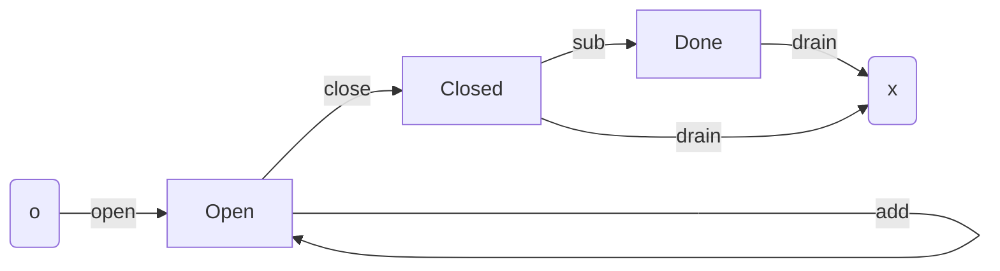
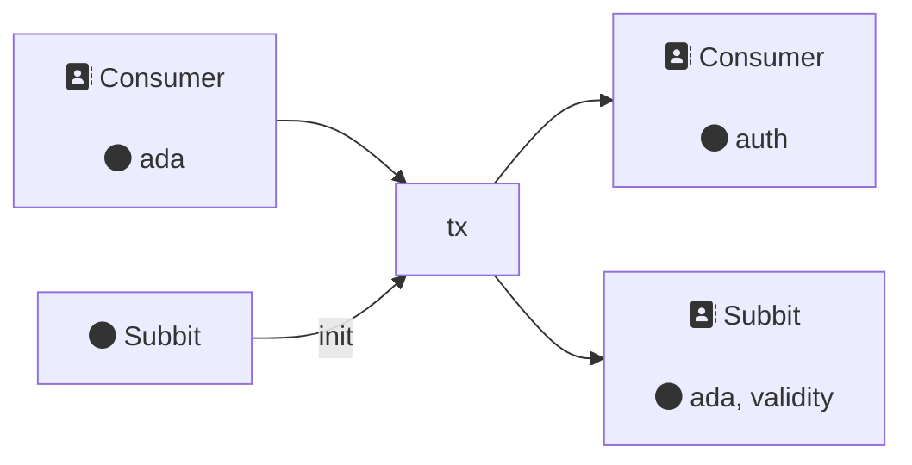
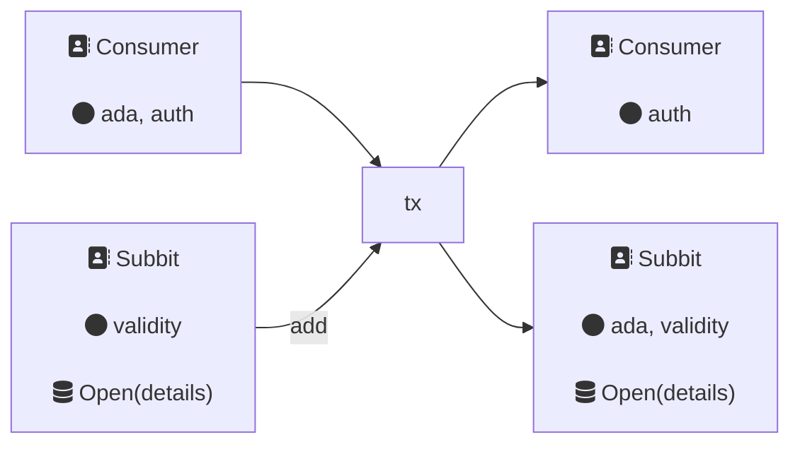
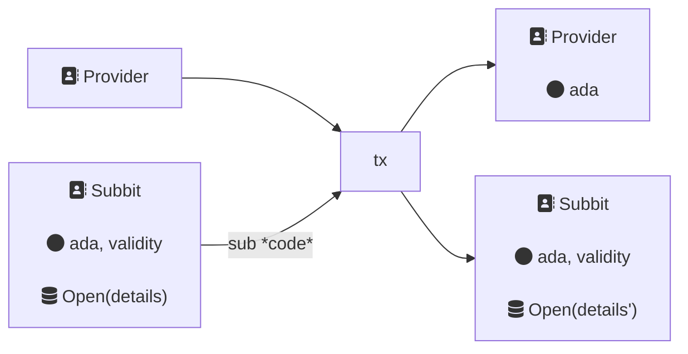
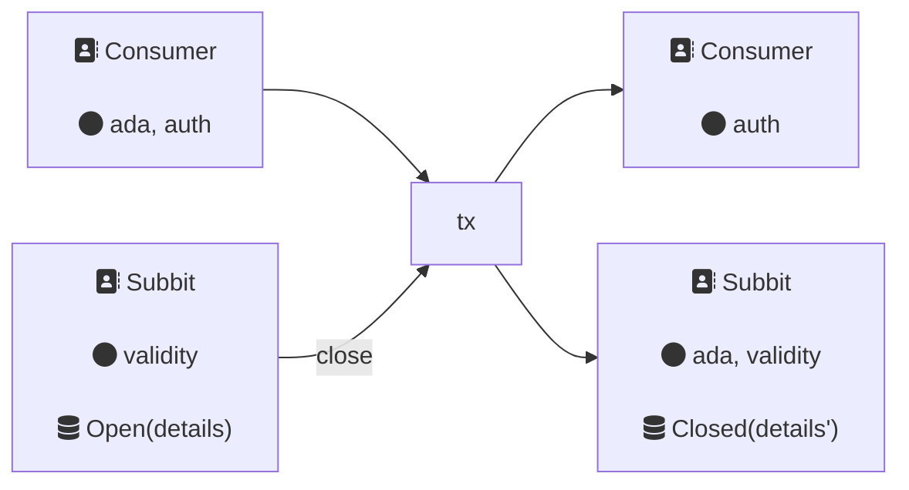
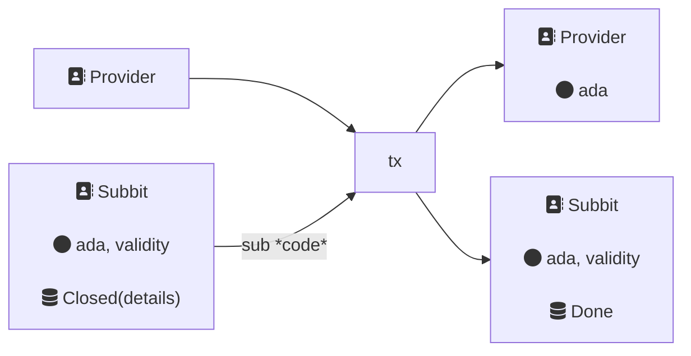
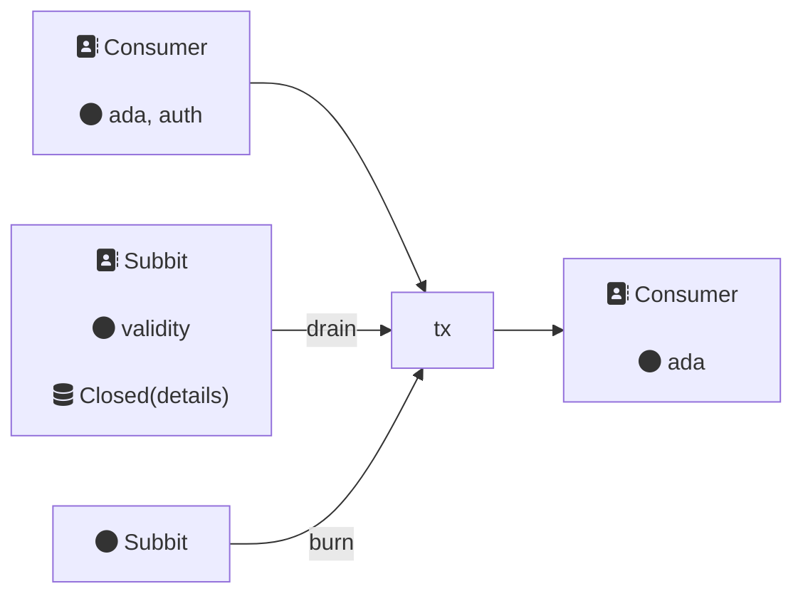

## Intro

This document contains:

- A non-technical description of how the dapp works
- A specification in terms of validators, constants, tokens, datatypes, and transactions (txs)
- A description of terms
- Additional comments

### Overview

Subbit is an unidirectional two-party payment channel. 
It is probably the simplest useful L2. 
It models the most typical type of ongoing financial engagement:
a consumer paying a provider. 

A question is when does the consumer pay and to whom is there risk? 
At the two extremes: the consumer pays everything up front, or pays everything at then. 
In the former, the consumer burndens all the risk. If provider goes rogue, the consumer loses out.In the latter, the converse is true: all the risk is on the provider. 
Regular payments reduce risk for both parties, but increase the administrative cost (ie tx fees).

In a decentralized world, this risks real and recourse is hard. 
A payment channel gives us a way to minimise risk for both parties,
while minimizing tx costs.  

The life cycle of a subbit account looks like this: 


The consumer wishes to receive the services of a provider.
The consumer `open`s a subbit account including details from the provider.

While the account is open, the consumer repeatedly requests service from the provider.
This happens off-chain. 
Each request, the consumer includes a redemption code to the provider.
The provider can verify that the code is correct (the account is sufficiently funded, _etc_), 
and can honor the request.

The provider is protected by the L1 in that at a time of their choosing they can `sub` their dues from the account. 
The consumer is protected by the L1 in that the provider can `sub` only as much as the last redemption code.

Whenever the account is low, the consumer can `add` to their account.

Once the consumer no longer wants the service, they can `close` their account. 
There is then a pre-agreed time window for the provider to make their last `sub`, 
after which the consumer can `drain` the remaining funds.

## Constants

See the tokens section for how this is used.
```
tag_length = 20
```

## Tokens

Each new init creates a new pair of twinned tokens: 
one held  by the consumer, the other locked in the account utxo.

```
auth_pref = #"000643b0"
vali_pref = #"000de140"
label = "subbit"
auth_name (tag) = auth_pref + label + tag 
vali_name (tag) = vali_pref + label + tag 
```

Each pair of user twin tokens use an input utxo oref as a seed to create an essentially unique tag `tag`. 
The function `mk_tag : OutputReference -> Tag` uses `blake2b_256` plutus builtin as hash function,
and truncates the result to a 20 byte (set by `constants.tag_length`) (160-bit) digest. 
It leaves 12 bytes of space in token names for human friendly labels.


## Validator

The dapp consists of a single multi-purpose validator.

A  **subbit account** is a well formed utxo locked at the script address.
Each account can be identified by an NFT, the validity token, that traces the lifecycle across events. 
In blockchain speak, each of these events is a transaction. 

Account ownership is governed by an auth token twinned to the validity token. 
For example, only with the token can an account be `close`d and `drain`ed.

Implementation restrictions: 

- Only one subbit account can be `init` per tx
- An account cannot be `drain`ed in the same tx as another is `init`ted.

### Datatypes

```
type Count = Int
type PubKey = ByteArray

type Dat {
  Open(OpenParams)
  Closed(ClosedParams)
  Done
}

type OpenParams {
  consumer : PubKey,
  provider : PubKey, 
  last : Int,
  count : Count,
}

type ClosedParams {
  consumer : PubKey,
  provider : PubKey, 
  deadline: Int,
  count : Count,
}

type Red2 {
  Init(OutputReference)
  Burn
}

type ContIdx = Int
type AuthIdx = Int
type Proof = ByteArray

type Red3 {
  Add(ContIdx, AuthIdx)
  Sub(ContIdx, Count, Proof)
  Close(ContIdx, AuthIdx)
  Drain
}

type SubParams {
  cont_idx : Int,
  amt : Int,
  proof : ByteArray,
}
```


### Constraints

Two params: Purpose is `Mint(own_hash)`

When red is `Init(seed)`:

1. `seed` is spent
2. Own mint value is twin pair with `tag(seed)`
3. Output script token to own (payment) address

When red is `Burn`:

1. Own mint value is negative

Three params: Purpose is `Spend(own_oref)`.

For all but one case, we expect a continuing output, 
where attributes will have the prefix `cont`. 
The redeemer is used to inform the validator where to find the `cont_output`,
and it is verified by the inclusion of the script token. 
The script token never leaves the script payment credential,
while the owner may update the stake credential. 
The value `cont_value` of the continuing output will be ada and the script token.
Let `diff = cont_value - own_value`, an difference between `cont` and `own` of ada.

Match on `(dat, red)`:

1. `Open(open_params), Add(cont_idx, auth_idx) `
    1. Cont address is: 
        1. Own address, or 
        2. Own payment credential, and auth token in `auth_idx` output
    2. `diff >= 0`
    3. Cont datum is own datum
2. `Open(open_params), Sub(cont_idx, count, proof)`
    1. Cont address is own address
    2. `count - open_params.count >= (- diff)`
    3. Cont datum is `Open { ..open_params , count}`
    4. Provider has signed tx
    5. Verify proof `verify(consumer, count, proof)`
3. `Open(OpenParams { consumer, provider, last, count,}), Close(cont_idx, auth_idx)`
    1. Cont payment cred is own payment cred
    2. `diff >= 0`
    3. Cont datum is `Closed { consumer, provider, deadline, count}`
    4. Auth token in `auth_idx` output
    5. Validity interval has upper bound `ub` and `deadline >= ub + last`
4. `Closed(shut_params), Sub(cont_idx, count, proof)`
    1. Cont address is own address
    2. `count - open_params.count >= (- diff)`
    3. Cont datum is `Done`
    4. Provider has signed tx
    5. Verify proof `verify(consumer, count, proof)`
5. `Closed(shut_params), Drain`
    1. Validity interval has lower bound `lb` and `deadline <= lb`
    2. Token twins are burnt
6. `Done, Drain`
    1. Token twins are burnt

#### Notes 

Users must verify aspects off-chain. 

Providers will need to be watching and interrogating accounts regularly. 
It is in their interest and is their responsibility to check that 
the any account is well-formed before engaging with it. 
There is not, and could not be, a check that the `provider` field is correct,
since a priori this key may only be known to the two parties.
Similarly `last` is up to the two parties.

A provider must check the initial account utxo has:
  - validity token present at utxo at correct payment credential address
  - correct `provider` and `last` values
  - `count == 0`
  - no reference script, although this is at most an irritant

After the init, the validator script does check the continuing utxo is well-formed.
This keeps both parties safe from malicious behaviours of others.

## Functions 

**Make Message**

There are many ways we do this.

The message should be salted.
That way, if the consumer was reusing their key for multiple accounts, 
or for another purpose, the provider cannot reuse an existing proof.
The account tag is essentially unique, and thus we use it as a salt. 

We should not serialise more than once - a general rule when handling cbor and signatures.
Thus if the message is a cbor serialized datastructure, then it should appear in the redeemer, be deserialised on-chain, and checked. 
An alternative is not use cbor, 

We concat byte arrays
```
  concat(tag, integer_to_bytearray(count)) 
```
There is then a choice about how `integer_to_bytearray` works.
We use little endian, of smallest length.
Plutus V3 has a builtin with args for endianness and length and then
```
integer_to_bytearray = builtin.integer_to_bytearray(False, 0, _)
```

**Verify**

With the message we then use ED25519 signatures since they are widely supported.
```
  builtin.verify_ed25519_signature( vkey, message, proof) 
```
Other signature schemes are easily used in place.

## Transactions

A transaction consists of inputs and outputs of utxos. Each utxo has a

- unique reference,
- an address it belongs to
- a value of ada + native assets (possibly no native assets)
- maybe a datum or datum hash.
(Note that a utxo at a script address must have a datum or datum hash to be spendable.)

Addresses correspond to either agents (eg normal addresses), or script addresses. All transactions
must have at least one input that belongs to a payment address _ie_ an agent's
address. When there are no constraints as to who the payment address belongs to,
then we may write _Any_ as the address owner. 
Addresses, unless otherwise stated, refer to only the payment credential
while the staking credential is unrestricted.

The diagrams are to be indicative and informative, rather than provide and exhaustive description.

In the following diagrams boxes denote utxos. Owners of an address are stated
first, then any notable assets or ada (that is, ignoring min ada or ada value
doesn't change or change is negligible), then datums where relevant. All datums
are assumed inline unless stated otherwise.

### `tx.open`

The consumer opens a subbit account. 




### `tx.add`

The consumer adds funds to their account.
This can happen any time the account is `Open`.
They can also use this to re-stake the account. 

Provided the stake credential of the account is unchanged, then no auth token is required.  
(A consumer is happy to accept donations.)



### `tx.sub`

The provider removes funds using their redemption code.
They tx must be signed by them. 

The datum records the cumulative amount withdrawn,
while all other information is unchanged.




### `tx.close`

The consume closes the account using their auth token. 
This fixes a deadline, recorded in the datum before which the provider must make their final `sub`.



### `tx.final_sub`

The provider performs their final withdraw. 




### `tx.drain`

If either: 

- the deadline has past for final sub
- the account is `Done`

then the consumer can burn the twin tokens and drain the remaining ada. 

In this example, the deadline has passed.



## Comments 

### Weaknesses

## Appendix

### Documentation Issues

- [mermaidjs bug: direction of subgraphs untameable](https://github.com/mermaid-js/mermaid/pull/4740)
